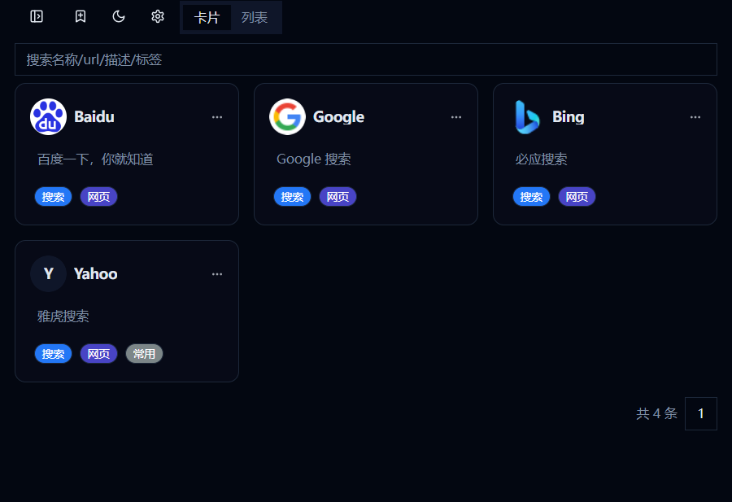
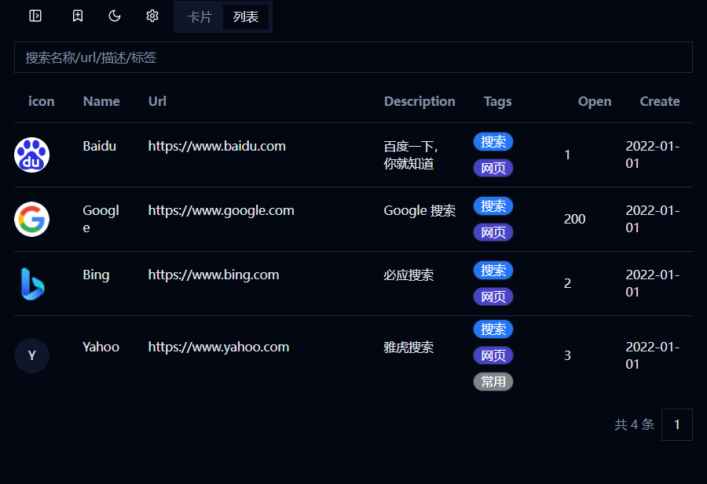
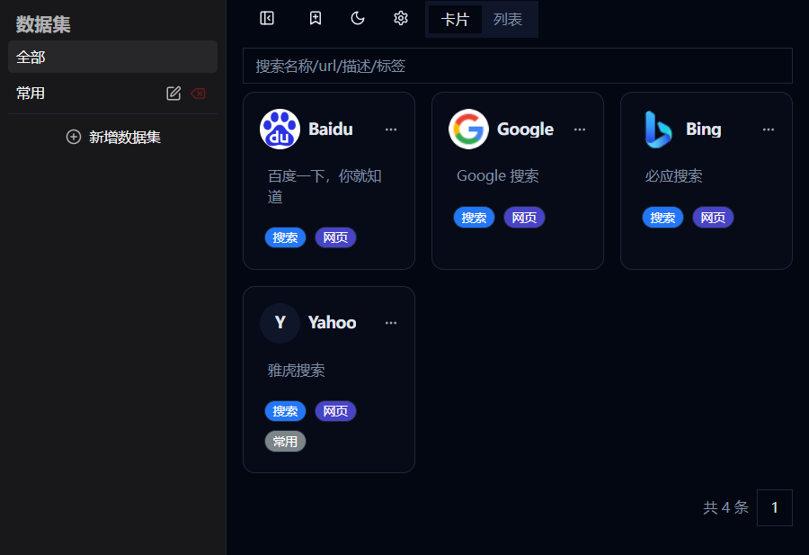
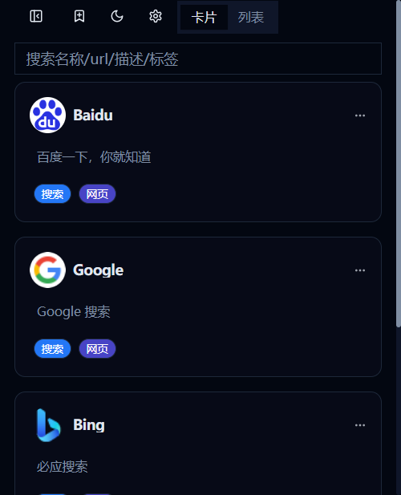
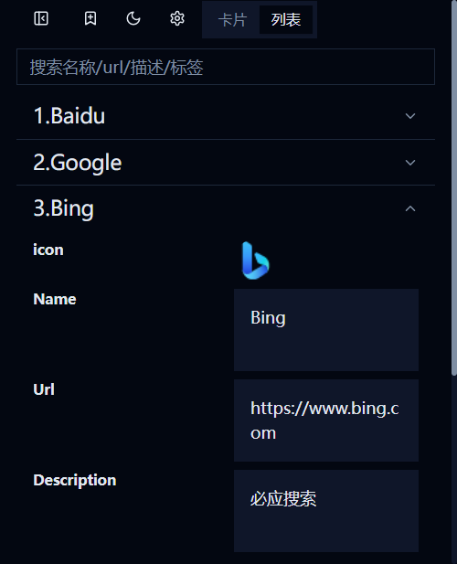
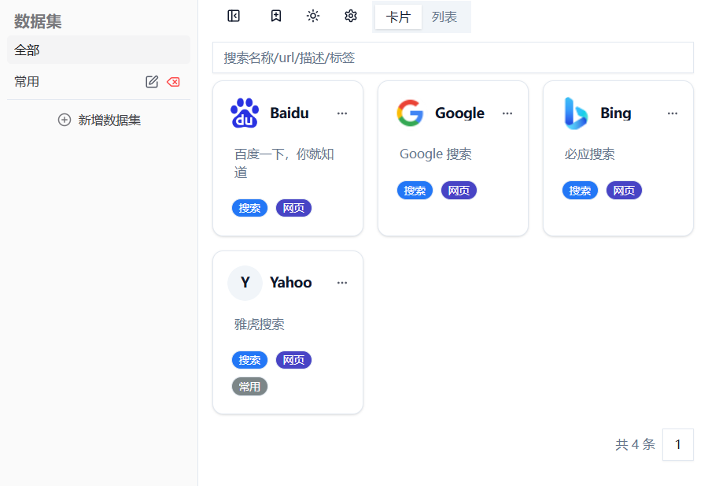

# Collect Frontend

This is the frontend of the Collect project.

You can use this project to record the websites you are interested in.

## Features

- Record the websites you are interested in.
- View the recorded websites in a table.
- View the recorded websites in a card.
- View the recorded websites in a dataset.
- Filter the recorded websites.
- View the recorded websites in a responsive layout.
- Switch between light and dark themes.
- Sync the recorded websites with a WebDAV server.

## Requirements

- Node.js 16+
- pnpm

## Dependencies

- React
- zustand
- radix-ui
- Shadcn
- Tailwind CSS
- Typescript
- Rsbuild
- webdav

## Setup

Install the dependencies:

```bash
pnpm install
```

## Get Started

Start the dev server:

```bash
pnpm dev
```

Build the app for production:

```bash
pnpm build
```

Preview the production build locally:

```bash
pnpm preview
```

## Preview

card preview:



table preview:



dataset preview:



responsive preview:





light theme preview:



## License

This project is licensed under the MIT License - see the [LICENSE](LICENSE) file for details.